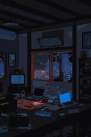

<h1 align="center">Hey there! I'm Prem Sai 👋</h1>

  🚀 Aspiring SDE • 💻 Full-Stack Learner • ⚙️ DSA Explorer • 🎷 Music Buff

---

## 🧠 Who Am I?

Hey! I’m a curious and caffeine-fueled B.Tech undergrad from Hyderabad 🇧🇲. Currently diving deep into the world of **web development** and **DSA**, while balancing gym life, side-projects, and the occasional existential bug. 😅

When I’m not coding, you’ll usually find me:
- 💪 at the gym working out,
- 🎵 vibing to music (gym, travel, or just chill),
- 🍳 cooking up something fun (yes, I like to cook),
- 🌌 watching space facts or random knowledge rabbit holes on YouTube,
- or 🔀 deep into an anime binge.

---

## 🔥 Currently Cooking

- 🍱 Learning Full-Stack Dev: React, Node, Express, MongoDB & Firebase
- 🧪 Practicing DSA in C++
- 🛠 Working on open-source and club websites
- 🧘‍♂️ Trying to stay chill during hackathons
- 🧠 Brushing up Git, GitHub, and Linux skills
- 🏋️‍♂️ Lifting weights (and sometimes my spirits)

---

## 🌸 Anime I Can Rewatch Forever

When I’m not battling bugs or lifting weights, I’m probably binge-watching one of these gems:

- 🔥 **Attack on Titan** – Plot twists sharper than Levi’s blades.
- ✉️ **Death Note** – Morally gray never looked this cool.
- ⚔️ **Solo Leveling** – Just me imagining I’m Sung Jin-Woo at the gym.
- 🧪 **Dr. Stone** – Science bros > Wi-Fi.
- 🏐 **Haikyuu!!** – Pure motivation with every spike.
- 🍥 **Naruto** – Believe it. Still hits like childhood.
- 🔥 **Demon Slayer** – Art, emotion, and elite swordsmanship.
- ⚽ **Blue Lock** – Soccer + ego = chaotic brilliance.
- 🌀 **Jujutsu Kaisen** – Dark vibes + Gojo supremacy.
- 🚪 **Suzume** – Makoto Shinkai never misses.
- 🎓 **Classroom of the Elite** – Trust no one, but enjoy the chaos.
- 🌸 **Hell’s Paradise** – Beautifully brutal and bizarre.

No ranking here — they all hit differently depending on my mood. Got a rec? Let’s trade anime lists!

---

## 📻 Now Playing on Spotify

  

---

## 💻 Tech Stack

---

## 🤝 Let’s Connect!

<table>
  <tr>
    <td valign="top">

Whether it’s a collab, code review, anime recommendation, or just life talk — I'm just one ping away:

- 🧑‍💼 [LinkedIn](https://linkedin.com/in/premsai22k)  
- 📷 [Instagram](https://instagram.com/iblameprems)  
- 📌 [Pinterest](https://pinterest.com/premsai22k)  
- 🧠 [Reddit](https://reddit.com/user/ShallotOk6811)  
- 🐦 [X / Twitter](https://x.com/premsaik22)

    </td>
    <td valign="top" width="320" style="padding-left: 20px;">
      
    </td>
  </tr>
</table>

---

## 📊 GitHub Stats

   
   
  

---

## 🤎 Random Fact

> I once played PUBG Mobile for 12+ hours a day and reached Top 36 in NA Server.  
> Now, I channel that same commitment to debugging and backend configs. 😅

---

## 💰 Support My Coding Fuel (coffee ☕ or protein 🤼)

If you enjoy my work or just want to buy me a coffee to fuel more late-night commits:

---

  

  

<!-- Made with ☕ & passion by Prem Sai | prem22k -->
