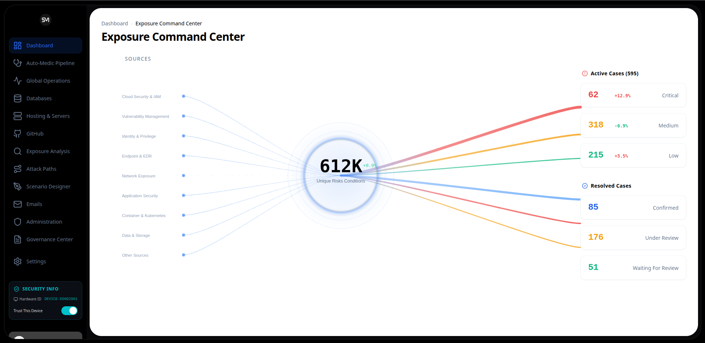
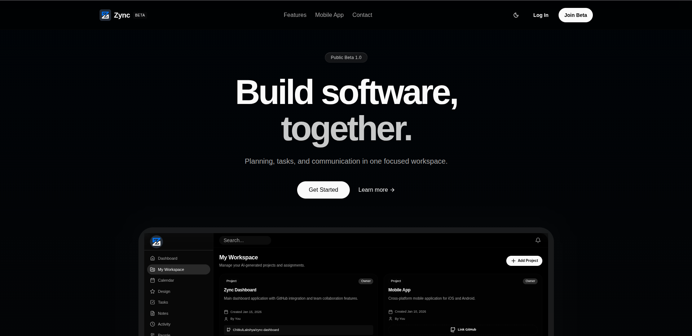
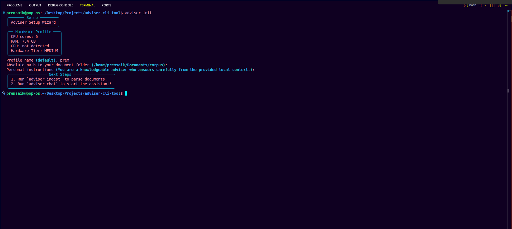

  
   
   
  <h1>Prem Sai Kota</h1>

  ### ⚡ 2026 Focus: Real-time collaborative apps, AI-native tools, and scalable backend architectures.

  
  
  

 

## 👨‍💻 About Me

I am a product-focused full-stack engineer with production internship experience and published npm packages. I am equally comfortable architecting robust Redis-backed rate limiters as I am building pixel-perfect, accessible React design systems.

- 💼 Currently working as a **Full-Stack Developer Intern @ RigorBase** & **Technical Head @ Cloud Community Club (C³)**. 
- 🔭 Always exploring the intersection of **AI, Developer Tooling, and UI/UX**.
- 🤝 Status: **OPEN_TO_WORK** for internships and full-time opportunities.

---

## 💼 Work Experience

**RigorBase** | *Full-Stack Developer Intern* (Mar 2026 – Present)
- Built the closed beta access system end-to-end (schema design, Redis rate limiting, OAuth).
- Led the frontend migration to the v3 design system, improving UI consistency and developer velocity.
- Built interactive dashboards for learning metrics and gamification features like adaptive quizzes.

**Cloud Community Club (C³) @ SNIST** | *Technical Head / Lead Developer* (Nov 2024 – Present)
- Architected the club’s official platform serving 1,000+ active campus users using Next.js.
- Built automated email notification services with retry logic and configured robust CI/CD pipelines.

---

## 🛠️ Tech Stack & Arsenal

   
  
   
   
  
   
   
  
   
   

> **AI / LLMs:** RAG Pipelines, LangChain, ChromaDB, Ollama, MCP, Groq API, Gemini API

---

## 🚀 Featured Projects

*(Replace the placeholder images below with actual screenshots of your apps!)*

### 📡 [ServX](https://github.com/Servx-lab/ServX) - Infrastructure Monitoring & Incident Response

> A full-stack monitoring platform published as an npm workspaces monorepo with pluggable database adapters and AES-256 encrypted storage. Features automated incident detection via webhooks and real-time audit streaming over Server-Sent Events. **[Live Demo](https://servx.vercel.app/)**

### ⚡ [Zync](https://github.com/zync-meet/Zync) - Real-Time Collaborative Workspace

> Conflict-free document editing using Yjs CRDTs with live cursors and multi-namespace sync. Integrates a GitHub webhook parser for Kanban tasks and utilizes LLMs to generate architecture specs. **[Live Demo](https://zync-meet.vercel.app/)**

### 🤖 [Adviser-CLI](https://github.com/prem22k/adviser-cli-tool) - Local-First RAG Pipeline & AI Assistant

> A fully local RAG pipeline combining ChromaDB vector search with BM25 sparse retrieval. Features a VisionRAG module using ColPali patch embeddings for PDFs, published as an MCP server to npm for use with AI coding assistants. **[npm Package](https://github.com/prem22k/adviser-cli-tool/pkgs/npm/adviser-cli)**

---

## 🏆 Achievements & Hackathons

- 🥇 **Brainrot Hackathon (Double Track Winner):** Outperformed 1,224 entrants to win both prize tracks for an innovative full-stack web application.
- 🏅 **National Hackathon (5th Place):** Built and deployed an integrated hardware/software system in 48 hours out of 230+ teams at JNTUH HackFusion-2K26.

---

## 📈 Contribution Graph & Activity

  <picture>
    <source media="(prefers-color-scheme: dark)" srcset="https://github-readme-activity-graph.vercel.app/graph?username=prem22k&bg_color=0D1117&color=ff4d4d&line=ff4d4d&point=ffffff&area=true&hide_border=true">
    <source media="(prefers-color-scheme: light)" srcset="https://github-readme-activity-graph.vercel.app/graph?username=prem22k&bg_color=ffffff&color=cc0000&line=cc0000&point=333333&area=true&hide_border=true">
    
  </picture>
   
  <picture>
    <source media="(prefers-color-scheme: dark)" srcset="https://github-readme-stats.vercel.app/api/top-langs/?username=prem22k&layout=compact&hide_border=true&bg_color=0D1117&title_color=ff4d4d&text_color=c9d1d9">
    <source media="(prefers-color-scheme: light)" srcset="https://github-readme-stats.vercel.app/api/top-langs/?username=prem22k&layout=compact&hide_border=true&title_color=cc0000&text_color=333333&bg_color=ffffff">
    
  </picture>

