

  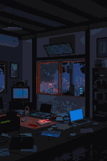

 

<picture>
  <source media="(prefers-color-scheme: dark)" srcset="assets/hero-dark.svg" />
  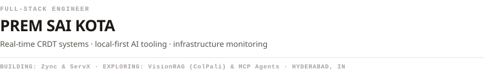
</picture>

[Portfolio](https://premsai.vercel.app/) &nbsp;·&nbsp; [GitHub](https://github.com/prem22k) &nbsp;·&nbsp; [LinkedIn](https://linkedin.com/in/premsai22k) &nbsp;·&nbsp; [Email](mailto:premsai224k@gmail.com)

---

## System Metrics

<picture>
  <source media="(prefers-color-scheme: dark)" srcset="assets/github-year-dark.svg" />
  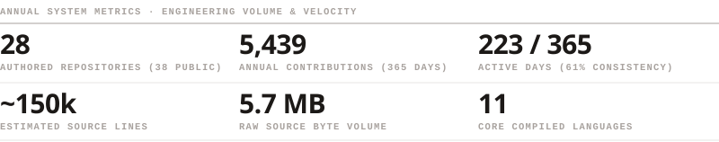
</picture>

---

## Selected Work

### 01 · Zync — Real-Time Collaborative Workspace

<a href="https://zync-meet.vercel.app/">
  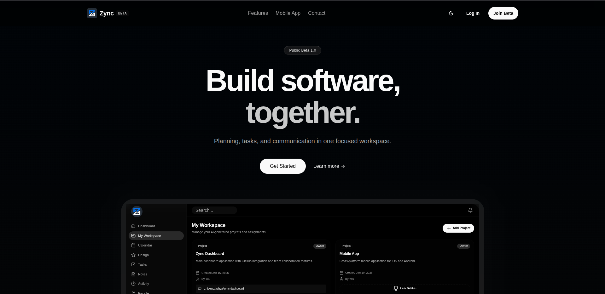
</a>

 

<picture>
  <source media="(prefers-color-scheme: dark)" srcset="assets/project-zync-arch-dark.svg" />
  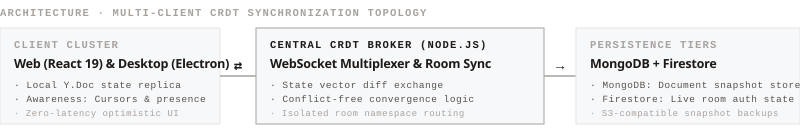
</picture>

> Distributed real-time workspace featuring conflict-free collaborative document editing powered by **Yjs CRDTs** with live cursor awareness and multi-namespace state synchronization. Packaged for web and desktop with Electron; persists document archives to **MongoDB** and live room session metadata to **Firestore**.

`TypeScript` · `Yjs CRDTs` · `WebSockets` · `React 19` · `Electron` · `MongoDB` · `Firestore`

[Live Platform ↗](https://zync-meet.vercel.app/) &nbsp;·&nbsp; [Source Code ↗](https://github.com/zync-meet/Zync)

---

### 02 · ServX — Infrastructure Monitoring & Incident Response

<a href="https://servx.vercel.app/">
  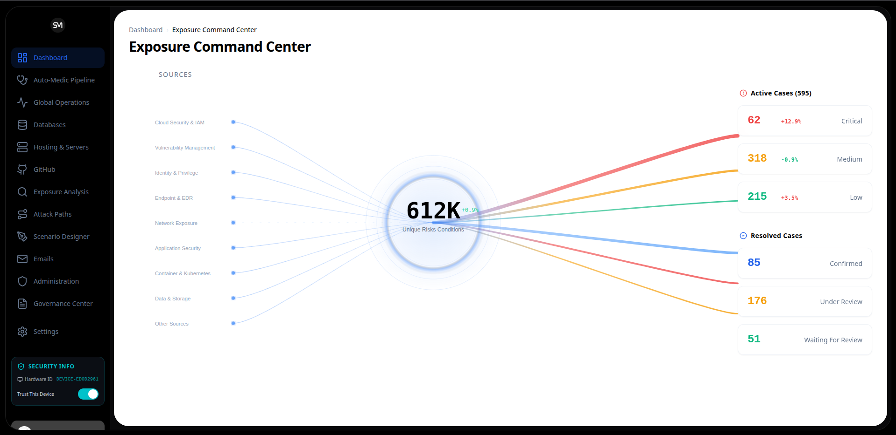
</a>

 

<picture>
  <source media="(prefers-color-scheme: dark)" srcset="assets/project-servx-arch-dark.svg" />
  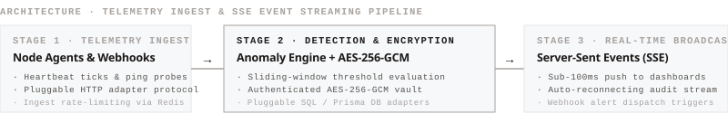
</picture>

> Production-grade full-stack infrastructure monitoring platform engineered as an npm workspaces monorepo. Implements automated telemetry ingest and incident anomaly detection with **AES-256-GCM encrypted persistence** and zero-polling real-time audit streams delivered via **Server-Sent Events (SSE)**.

`TypeScript` · `Node.js` · `Server-Sent Events` · `AES-256-GCM` · `Webhooks` · `Next.js` · `Redis`

[Live Platform ↗](https://servx.vercel.app/) &nbsp;·&nbsp; [Source Code ↗](https://github.com/Servx-lab/ServX)

---

### 03 · Adviser-CLI — Local-First Hybrid RAG & AI Hub

<a href="https://github.com/prem22k/adviser-cli-tool/pkgs/npm/adviser-cli">
  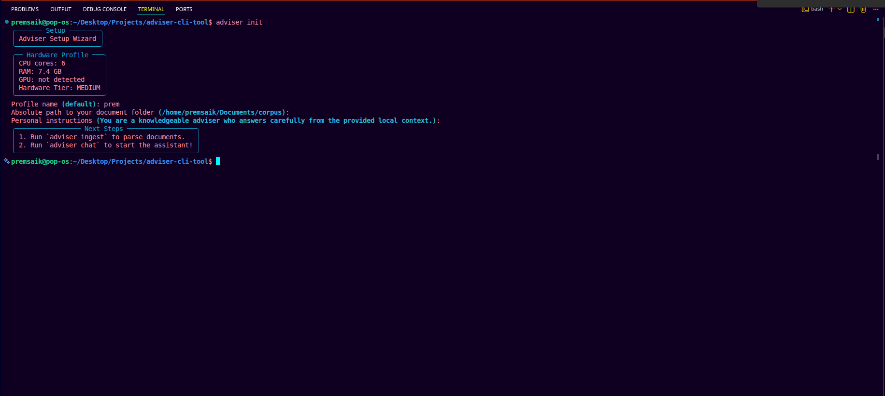
</a>

 

<picture>
  <source media="(prefers-color-scheme: dark)" srcset="assets/project-adviser-cli-arch-dark.svg" />
  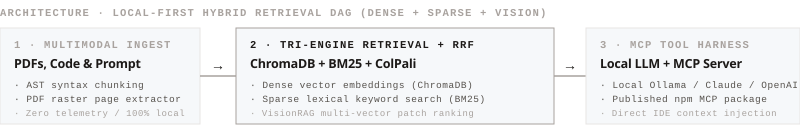
</picture>

> Zero-infrastructure local RAG developer intelligence tool fusing **ChromaDB dense vector embeddings** with **BM25 sparse keyword retrieval**. Features a **VisionRAG** engine using ColPali multi-vector patch embeddings for multimodal document reasoning, published to npm as an official **Model Context Protocol (MCP)** server.

`Python 3.11` · `ChromaDB` · `BM25` · `ColPali VisionRAG` · `Model Context Protocol (MCP)` · `Ollama / OpenAI`

[npm Package ↗](https://github.com/prem22k/adviser-cli-tool/pkgs/npm/adviser-cli) &nbsp;·&nbsp; [Source Code ↗](https://github.com/prem22k/adviser-cli-tool)

---

## Codebase Architecture

<picture>
  <source media="(prefers-color-scheme: dark)" srcset="assets/codebase-dark.svg" />
  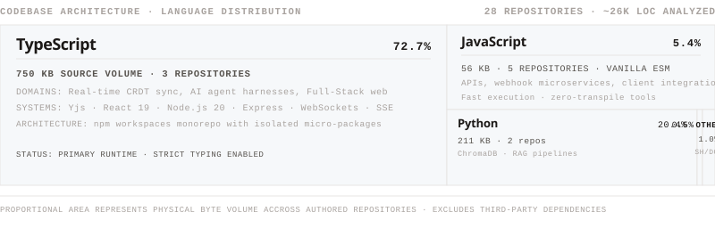
</picture>

---

## Engineering Stack

<picture>
  <source media="(prefers-color-scheme: dark)" srcset="assets/stack-dark.svg" />
  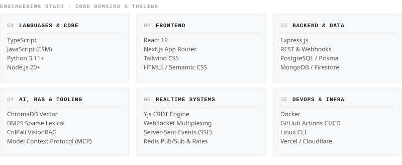
</picture>

---

## Contribution Velocity

<picture>
  <source media="(prefers-color-scheme: dark)" srcset="assets/activity-dark.svg" />
  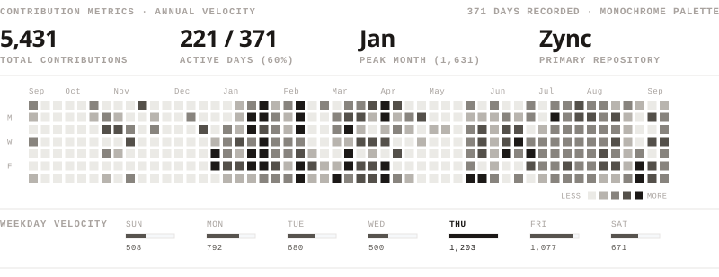
</picture>

---

## Recent Engineering Activity

| Date | Event | Repository | Context |
| :--- | :--- | :--- | :--- |
| `15 AUG` | `pushed` | [**ServX**](https://github.com/Servx-lab/ServX) | Audit streaming over SSE & AES-256-GCM encrypted persistence |
| `15 AUG` | `pushed` | [**Zync**](https://github.com/zync-meet/Zync) | Yjs CRDT live cursors & multi-namespace sync |
| `13 AUG` | `created` | [**skillpath**](https://github.com/prem22k/skillpath) | Interactive developer curriculum engine |
| `19 JUL` | `pushed` | [**verion**](https://github.com/prem22k/verion) | Versioned system configuration harness |
| `07 JUL` | `updated` | [**Adviser-CLI**](https://github.com/prem22k/adviser-cli-tool) | ChromaDB vector & ColPali VisionRAG module |

---

## Experience

**RigorBase** — `Full-Stack Developer Intern` &nbsp;·&nbsp; **Mar 2026 – Apr 2026**
- Built closed beta access system end-to-end: schema design, OAuth 2.0, and Redis rate limiting.
- Led frontend migration to v3 design system — improved DX and UI consistency across teams.
- Shipped interactive learning-metric dashboards and adaptive quiz gamification.

 

**Cloud Community Club (C³) @ SNIST** — `Technical Head / Lead Developer` &nbsp;·&nbsp; **Nov 2024 – Present**
- Architected official club platform serving 1,000+ active campus users ([Next.js](https://nextjs.org)).
- Automated transactional email notification microservice with retry queues and CI/CD pipelines.

---

## Recognition

- **Brainrot Hackathon** &nbsp;·&nbsp; `Double-Track Winner` *(2025)*  
  *Awarded 1st place across both competitive tracks for full-stack real-time web application architecture out of 1,224 entrants.*

- **JNTUH HackFusion-2K26** &nbsp;·&nbsp; `5th Place Nationally` *(2026)*  
  *Built and deployed an integrated hardware/software system in 48 hours out of 230+ national teams.*