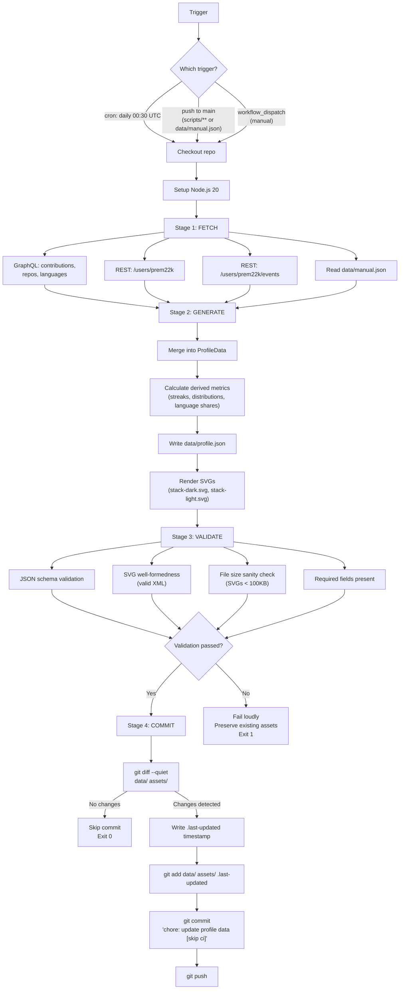

# Workflow Architecture

**Repository:** `prem22k/prem22k`  
**Runtime:** GitHub Actions (ubuntu-latest, Node.js 20)  
**Data Contract:** [DATA-SPEC.md](file:///home/premsaik/Desktop/Projects/prem22k/DATA-SPEC.md)

---

## Decision: One Workflow, Not Three

Separate workflow files for scheduled/push/manual triggers are **unnecessary**. All three triggers execute the identical pipeline:

```
fetch → normalize → generate → validate → commit
```

Splitting into 3 files creates:
- 3× maintenance surface (any pipeline change requires editing 3 files)
- Divergence risk (one file gets updated, others don't)
- No behavioral difference between triggers

**One workflow file with multiple triggers is the correct architecture.**

If a genuinely different pipeline emerges later (e.g., a monthly screenshot refresh that requires a browser), it can be a separate workflow. But for the current scope, one file handles everything.

---

## Workflow File

```
.github/
└── workflows/
    └── profile-update.yml      # Single workflow, 3 triggers
```

---

## Pipeline Diagram



---

## Complete Workflow YAML

```yaml
# .github/workflows/profile-update.yml
name: Update Profile Data & Assets

on:
  schedule:
    - cron: '30 0 * * *'             # Daily at 00:30 UTC (06:00 IST)

  push:
    branches: [main]
    paths:
      - 'data/manual.json'           # Manual content changed
      - 'scripts/**'                 # Build/fetch logic changed
      - 'README-DESIGN-SYSTEM.md'    # Design tokens changed

  workflow_dispatch:                   # Manual trigger via GitHub UI
    inputs:
      force_commit:
        description: 'Commit even if no changes detected'
        type: boolean
        default: false

# Prevent concurrent runs from stomping each other
concurrency:
  group: profile-update
  cancel-in-progress: true

# LEAST-PRIVILEGE: only contents:write to commit generated files
permissions:
  contents: write

jobs:
  update-profile:
    runs-on: ubuntu-latest
    timeout-minutes: 5                # Hard ceiling — if stuck, fail fast

    steps:
      # ── CHECKOUT ──────────────────────────────────────────
      - name: Checkout repository
        uses: actions/checkout@v4
        with:
          token: ${{ secrets.GITHUB_TOKEN }}
          fetch-depth: 1              # Shallow clone — we don't need history

      # ── SETUP ─────────────────────────────────────────────
      - name: Setup Node.js
        uses: actions/setup-node@v4
        with:
          node-version: '20'

      # ── STAGE 1: FETCH ────────────────────────────────────
      - name: Fetch GitHub data
        id: fetch
        run: node scripts/fetch-data.mjs
        env:
          GITHUB_TOKEN: ${{ secrets.GITHUB_TOKEN }}
          GITHUB_USERNAME: prem22k
        continue-on-error: true       # Don't kill the pipeline on API failure

      # ── STAGE 1: FALLBACK ─────────────────────────────────
      - name: Handle fetch failure
        if: steps.fetch.outcome == 'failure'
        run: |
          echo "::warning::GitHub API fetch failed. Using cached data/profile.json."
          if [ ! -f data/profile.json ]; then
            echo "::error::No cached profile.json exists. Cannot proceed."
            exit 1
          fi
          echo "FETCH_FAILED=true" >> "$GITHUB_ENV"

      # ── STAGE 2: GENERATE ─────────────────────────────────
      - name: Generate SVG assets
        id: generate
        run: node scripts/build-assets.mjs

      # ── STAGE 3: VALIDATE ─────────────────────────────────
      - name: Validate outputs
        run: node scripts/validate.mjs

      # ── STAGE 4: COMMIT ───────────────────────────────────
      - name: Check for changes
        id: changes
        run: |
          git add data/ assets/ .last-updated 2>/dev/null || true
          if git diff --cached --quiet; then
            echo "has_changes=false" >> "$GITHUB_OUTPUT"
            echo "No changes detected. Skipping commit."
          else
            echo "has_changes=true" >> "$GITHUB_OUTPUT"
            echo "Changes detected in generated files."
            git diff --cached --stat
          fi

      - name: Commit and push
        if: steps.changes.outputs.has_changes == 'true' || github.event.inputs.force_commit == 'true'
        run: |
          git config user.name "github-actions[bot]"
          git config user.email "41898282+github-actions[bot]@users.noreply.github.com"
          git commit -m "chore: update profile data [skip ci]"
          git push
```

---

## Stage Details

### Stage 1: FETCH (`scripts/fetch-data.mjs`)

| Action | API | Cost | Output |
|---|---|---|---|
| Fetch contribution calendar + repos + PRs + issues | GraphQL `POST /graphql` | ~30 points | Raw GraphQL response |
| Fetch user identity | REST `GET /users/prem22k` | 1 request | User object |
| Fetch recent events | REST `GET /users/prem22k/events?per_page=100` | 1 request | Events array |
| Read manual data | Filesystem `data/manual.json` | 0 | Manual fields |
| **Normalize** | In-memory | 0 | Merged `ProfileData` object |
| **Calculate derived metrics** | In-memory | 0 | Streaks, distributions, language shares |
| **Write** | Filesystem `data/profile.json` | 0 | Serialized JSON |

**Total API cost per run:** ~32 requests/points out of 1,000/hr limit.

### Stage 2: GENERATE (`scripts/build-assets.mjs`)

| Input | Output | Count |
|---|---|---|
| `data/profile.json` | `assets/stack-dark.svg` | 1 |
| `data/profile.json` | `assets/stack-light.svg` | 1 |
| (timestamp) | `.last-updated` | 1 |

**Total generated files:** 3 (2 SVGs + 1 timestamp).

The build script reads `data/profile.json` and the design system tokens. It does NOT make any API calls. This is the reproducibility guarantee: given the same `profile.json`, the same SVGs are produced regardless of where the script runs.

### Stage 3: VALIDATE (`scripts/validate.mjs`)

| Check | Method | Failure Behavior |
|---|---|---|
| `data/profile.json` exists and is valid JSON | `JSON.parse()` | Exit 1 |
| Required fields present (`identity.name`, `overview.publicRepos`, `contributions.year`) | Field traversal | Exit 1 |
| `contributions.year` matches current year | `=== new Date().getUTCFullYear()` | Warning (stale data) |
| SVG files are well-formed XML | Regex check for `<svg` opening and `</svg>` closing | Exit 1 |
| SVG files are under 100KB | `fs.statSync().size` | Warning |
| No token-violating colors in SVGs | Grep for non-system hex values | Warning |

### Stage 4: COMMIT

**Change detection logic:**

```bash
git add data/ assets/ .last-updated
git diff --cached --quiet    # Exit 0 = no changes, exit 1 = changes exist
```

If no files changed, the workflow exits cleanly with no commit. This prevents:
- Empty commits polluting git history
- Unnecessary pushes triggering recursive workflows
- The `[skip ci]` tag in the commit message prevents the push trigger from re-running the workflow

---

## Failure Handling

### Failure Mode Matrix

| Failure Point | Detection | Behavior | User Impact |
|---|---|---|---|
| **GraphQL API down** | `fetch-data.mjs` exits non-zero | `continue-on-error: true` → use cached `data/profile.json` | README shows last valid data. Log warns. |
| **GraphQL rate limited** | HTTP 403 with `X-RateLimit-Remaining: 0` | Same as API down — fallback to cache | Same as above |
| **GraphQL returns partial data** | Missing expected fields in response | Script fills with fallback values per DATA-SPEC | Some metrics show `0` or `"Unknown"` |
| **REST /events fails** | HTTP error or timeout | `recentActivity` populated with empty arrays | Activity section may show stale data |
| **`data/manual.json` missing** | `fs.existsSync()` check | Script uses hardcoded defaults | Manual sections show placeholder text |
| **`data/profile.json` missing AND API fails** | No cache + no fresh data | **Hard failure.** Exit 1. Cannot generate SVGs without data. | Workflow fails loudly. Existing committed assets are untouched. |
| **SVG generation throws** | `build-assets.mjs` exits non-zero | Workflow fails. No commit. Existing assets preserved. | README unchanged. |
| **Validation fails** | `validate.mjs` exits non-zero | Workflow fails. No commit. | README unchanged. |
| **Git push fails** | Push rejected (force-push, branch protection) | Workflow fails at final step. Generated files exist in workspace but not committed. | README unchanged. |

### Preservation Guarantee

The critical invariant: **a failed workflow never destroys working assets.** The commit only happens after all 3 prior stages succeed. If any stage fails, the repository remains in its last known-good state.

---

## Timestamp

The `.last-updated` file is written during Stage 2 (GENERATE):

```
2026-08-21T00:30:00Z
```

A single line containing the ISO 8601 UTC timestamp of the last successful data generation. This file is:
- Committed alongside the generated assets
- Readable by the README (can be referenced in markdown or SVG)
- Diffable in git history (shows exact update cadence)

The timestamp is written by `build-assets.mjs`, not by the workflow YAML, to ensure local builds also produce it.

---

## Permissions Audit

| Permission | Granted | Justification |
|---|---|---|
| `contents: write` | ✅ | Required to `git push` generated files |
| `contents: read` | ✅ (implicit) | Required to checkout the repo |
| `issues: write` | ❌ | Not needed |
| `pull-requests: write` | ❌ | Not needed |
| `packages: write` | ❌ | Not needed |
| `deployments: write` | ❌ | Not needed |
| `actions: write` | ❌ | Not needed |
| `security-events: write` | ❌ | Not needed |
| `id-token: write` | ❌ | Not needed |

**`GITHUB_TOKEN` scope:** The default `GITHUB_TOKEN` in Actions has `contents: write` when explicitly granted. It can also read public repo data and make authenticated GraphQL queries against the user's own data. No PAT (Personal Access Token) is required — the default token is sufficient for all API calls in this pipeline.

### Token Usage

| API Call | Token Used | Why |
|---|---|---|
| GraphQL `contributionsCollection` | `GITHUB_TOKEN` | Required — GraphQL API needs authentication |
| REST `GET /users/prem22k` | `GITHUB_TOKEN` | Optional but used to avoid 60/hr unauthenticated limit |
| REST `GET /users/prem22k/events` | `GITHUB_TOKEN` | Optional but used for higher rate limit |
| `git push` | `GITHUB_TOKEN` (via checkout) | Required for write access |

---

## Local Development

### Running the pipeline locally

```bash
# Step 1: Fetch data (requires a GitHub token)
GITHUB_TOKEN="ghp_..." GITHUB_USERNAME="prem22k" node scripts/fetch-data.mjs

# Step 2: Generate assets (no token needed — reads from data/profile.json)
node scripts/build-assets.mjs

# Step 3: Validate (no token needed)
node scripts/validate.mjs
```

### Reproducibility guarantee

Given the same `data/profile.json` and `data/manual.json`:
- `build-assets.mjs` produces **byte-identical SVGs** regardless of execution environment
- No timestamps, random values, or environment-dependent content inside SVGs
- The `.last-updated` timestamp is the only environment-dependent output

### Offline development

```bash
# Use cached data (skip fetch, go straight to generate)
node scripts/build-assets.mjs      # Reads existing data/profile.json
```

This allows design iteration on SVGs without needing API access.

---

## File Tree After Implementation

```
prem22k/
├── .github/
│   └── workflows/
│       └── profile-update.yml     # Single workflow
├── assets/
│   ├── banner.gif                 # Static (non-generated)
│   ├── servx.png                  # Static (non-generated)
│   ├── zync-meet.png              # Static (non-generated)
│   ├── adviser-cli.png            # Static (non-generated)
│   ├── stack-dark.svg             # Generated
│   └── stack-light.svg            # Generated
├── data/
│   ├── manual.json                # Manually edited
│   └── profile.json               # Generated (committed as cache)
├── scripts/
│   ├── fetch-data.mjs             # Stage 1: API fetch + normalize
│   ├── build-assets.mjs           # Stage 2: SVG generation
│   └── validate.mjs               # Stage 3: Output validation
├── .last-updated                  # Generated timestamp
├── README.md                      # The profile README
├── README-DESIGN-SYSTEM.md        # Visual contract
├── DATA-SPEC.md                   # Data contract
├── WORKFLOW-ARCHITECTURE.md       # Automation architecture
└── AUDIT.md                       # Initial audit
```

### File Categories

| Category | Files | Committed | In .gitignore |
|---|---|---|---|
| **Source** | `scripts/*.mjs`, `data/manual.json`, `README-DESIGN-SYSTEM.md`, workflow YAML | ✅ | — |
| **Generated** | `assets/stack-*.svg`, `data/profile.json`, `.last-updated` | ✅ (as cache) | — |
| **Static assets** | `assets/banner.gif`, `assets/*.png` | ✅ | — |
| **Documentation** | `AUDIT.md`, `DATA-SPEC.md`, `WORKFLOW-ARCHITECTURE.md` | ✅ | — |
| **Node modules** | `node_modules/` | — | ✅ |

---

## Recursive Trigger Prevention

The workflow pushes commits with `[skip ci]` in the message. This prevents the push trigger from re-triggering the workflow, which would cause an infinite loop:

```
push → workflow runs → generates → commits → push → workflow runs → ...
```

The `[skip ci]` convention is respected by GitHub Actions and breaks the cycle.

Additionally, the `paths` filter on the push trigger ensures only changes to `data/manual.json`, `scripts/**`, or `README-DESIGN-SYSTEM.md` trigger a rebuild. Auto-committed changes to `data/profile.json` and `assets/*.svg` do not match these paths, providing a second layer of protection.

---

*This document defines the automation architecture. Implementation begins only after approval.*
